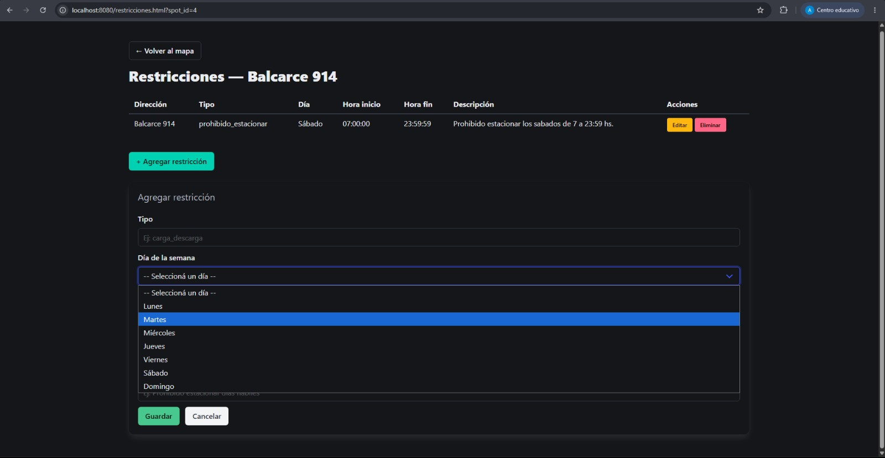

# 🅿️ FIUBAMIENTO

Plataforma web colaborativa para visualizar en tiempo casi real la disponibilidad de lugares de estacionamiento en las calles cercanas a la FIUBA (Av. Paseo Colón 850, CABA).

Antes de manejar hasta la zona, cualquier persona puede consultar el mapa y ver si hay lugar disponible, sin necesidad de dar vueltas a ciegas buscando dónde estacionar.

---

## ✨ Funcionalidades

- **Mapa en tiempo real** — visualización de lugares de estacionamiento con círculos de colores según su estado actual.
- **Reportes con ciclo de vida** — cualquier usuario puede reportar el estado de un lugar (`libre`, `ocupado`). Los reportes expiran automáticamente a las 3 horas, y el lugar pasa a estado `sin información reciente`.
- **Restricciones horarias** — cada lugar tiene asociadas las reglas vigentes de la zona (horarios prohibidos, carga y descarga, etc.). El sistema combina la disponibilidad reportada con la restricción horaria actual.
- **Gestión de reportes** — historial de reportes por spot, con posibilidad de editar y eliminar.
- **Gestión de restricciones** — ABM completo de restricciones horarias por spot.

---

## 🗂️ Entidades

| Entidad | Descripción |
|---|---|
| `spots` | Lugares de estacionamiento en la calle (datos geográficos) |
| `reportes` | Estados reportados por la comunidad para cada lugar |
| `restricciones` | Reglas horarias vigentes asociadas a cada lugar |

---

## 🛠️ Stack tecnológico

| Capa | Tecnología |
|---|---|
| Frontend | HTML, CSS, JavaScript vanilla |
| Mapa | [Leaflet.js](https://leafletjs.com/) |
| Backend | Node.js + Express |
| Base de datos | PostgreSQL |
| Contenedores | Docker + Docker Compose |

---

## 📁 Estructura del proyecto

```
FIUBAMIENTO/
├── backend/
│   ├── app/
│   │   ├── api/
│   │   │   ├── reportes.js
│   │   │   ├── restricciones.js
│   │   │   └── spots.js
│   │   ├── db/
│   │   │   ├── pool.js
│   │   │   ├── reportes.js
│   │   │   ├── restricciones.js
│   │   │   └── spots.js
│   │   ├── app.js
│   │   ├── calles.js
│   │   ├── package.json
│   │   └── package-lock.json
│   ├── data/
│   │   ├── 01_schemas.sql
│   │   └── 02_seeds.sql
│   ├── .dockerignore
│   └── Dockerfile
├── frontend/
│   ├── calles.js
│   ├── css/
│   │   ├── reportes.css
│   │   └── styles.css
│   ├── js/
│   │   ├── mapa.js
│   │   ├── reportes.js
│   │   └── restricciones.js
│   ├── index.html
│   ├── reportes.html
│   └── restricciones.html
├── docs/
│   └── screenshots/
│       ├── Mapa principal con spots.jpeg
│       ├── Popup de un spot.jpeg
│       ├── Agregar nuevo spot.jpeg
│       ├── Historial de reportes.jpeg
│       └── Restricciones.jpeg
├── .gitignore
├── docker-compose.yml
└── README.md
```

---

## 🚀 Cómo levantar el proyecto

### Requisitos previos

- [Docker](https://www.docker.com/) y [Docker Compose](https://docs.docker.com/compose/) instalados.
- Git instalado.

### Pasos

1. Clonar el repositorio:

```bash
git clone git@github.com:angiemoshkov/FIUBAMIENTO.git
cd FIUBAMIENTO
```

2. Levantar los servicios desde la raíz del repositorio:

```bash
docker compose up --build
```

Esto levanta tres servicios:

| Servicio | Puerto local |
|---|---|
| Frontend | http://localhost:8080 |
| Backend (API) | http://localhost:3000 |
| PostgreSQL | localhost:5433 |

La base de datos se inicializa automáticamente con el schema y los datos de prueba al primer arranque (carpeta `data/`).

---

## 🌐 Páginas del frontend

| Página | Descripción |
|---|---|
| `index.html` | Mapa principal con los spots, sus estados y CRUD completo |
| `reportes.html` | Historial de reportes por spot |
| `restricciones.html` | Gestión de restricciones horarias por spot |

---

## 🔌 Endpoints de la API

### Spots

| Método | Ruta | Descripción |
|---|---|---|
| `GET` | `/api/v1/spots` | Lista todos los spots con su estado calculado |
| `GET` | `/api/v1/spots/:id` | Detalle de un spot |
| `POST` | `/api/v1/spots` | Crear un nuevo spot |
| `PUT` | `/api/v1/spots/:id` | Actualizar un spot |
| `DELETE` | `/api/v1/spots/:id` | Eliminar un spot |

### Reportes

| Método | Ruta | Descripción |
|---|---|---|
| `GET` | `/api/v1/reportes?spot_id=X` | Historial de reportes de un spot |
| `GET` | `/api/v1/reportes/:id` | Detalle de un reporte |
| `POST` | `/api/v1/reportes` | Crear un nuevo reporte |
| `PUT` | `/api/v1/reportes/:id` | Actualizar un reporte |
| `DELETE` | `/api/v1/reportes/:id` | Eliminar un reporte |

### Restricciones

| Método | Ruta | Descripción |
|---|---|---|
| `GET` | `/api/v1/restricciones?spot_id=X` | Restricciones de un spot |
| `GET` | `/api/v1/restricciones/:id` | Detalle de una restricción |
| `POST` | `/api/v1/restricciones` | Agregar una restricción |
| `PUT` | `/api/v1/restricciones/:id` | Actualizar una restricción |
| `DELETE` | `/api/v1/restricciones/:id` | Eliminar una restricción |

### Lógica de estado en `GET /api/v1/spots`

Cada spot devuelve un campo `ultimo_estado` calculado en el backend según estas reglas, en orden de prioridad:

1. `restringido` — hay una restricción horaria activa en este momento.
2. `sin_informacion_reciente` — el último reporte expiró (más de 3 horas sin actividad).
3. `libre` / `ocupado` — el reporte más reciente es válido.

---

## 🖼️ Capturas de pantalla

### Mapa principal


### Popup de un spot


### Agregar nuevo spot


### Historial de reportes


### Restricciones


---

## 👥 Integrantes

| Nombre | GitHub |
|---|---|
| Ana Angelica Moshkov | angiemoshkov |
| Juan Manuel Bazan | jbazan-bazia |
| Emiliano Romano | emromanofiuba |

---

## 📝 Uso de Inteligencia Artificial

En el desarrollo de este proyecto se utilizaron asistentes de IA como herramienta de apoyo.
Todo el código presente en el repositorio fue revisado, comprendido y validado por los integrantes del grupo.